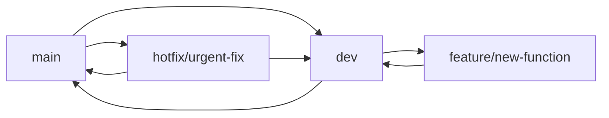

# AI胎教内容生成平台

[](https://github.com/your-username/prenatal-educator-offical/actions/workflows/ci.yml)
[](https://www.typescriptlang.org/)
[](https://reactjs.org/)
[](https://vitejs.dev/)
[](https://opensource.org/licenses/MIT)

基于火山引擎AI服务的智能胎教解决方案，为准父母提供个性化的胎教内容生成、多音色语音合成和声音复刻服务。

## 🚀 技术栈

- **前端**: React 18 + TypeScript + Vite + Tailwind CSS
- **后端**: Node.js + Express + TypeScript
- **数据库**: Supabase (PostgreSQL)
- **AI服务**: 火山引擎 Ark API + TTS API + 声音复刻API
- **图表**: Recharts
- **部署**: Vercel

## 📦 快速开始

### 环境要求
- Node.js 18+
- npm 或 pnpm

### 克隆项目
```bash
git clone https://github.com/your-username/prenatal-educator-offical.git
cd prenatal-educator-offical
```

### 安装依赖
```bash
npm install
# 或
pnpm install
```

### 环境配置

**重要：** 环境变量文件必须放在 `api/` 目录下，不是项目根目录。

```bash
# 1. 复制环境变量示例文件
cp env.example api/.env

# 2. 编辑环境变量文件
vim api/.env
# 或使用其他编辑器
code api/.env
```

**必填配置项：**
```env
# 火山引擎 API 配置（生产模式必填）
VOLCENGINE_ARK_API_KEY=your_ark_api_key_here
VOLCENGINE_TTS_ACCESS_TOKEN=your_tts_access_token_here
VOLCENGINE_APP_ID=your_app_id_here

# 运行模式（可选，默认为 mvp）
RUN_MODE=sandbox  # 开发时建议使用 sandbox 模式
SANDBOX=true      # 启用沙箱模式，无需真实 API 密钥
```

### 启动开发服务器

```bash
# 启动后端服务（端口 3001）
npm run dev:api

# 启动前端服务（端口 5173）
npm run dev

# 或同时启动前后端
npm run dev:full
```

**访问地址：**
- 前端应用：http://localhost:5173
- API 调试面板：http://localhost:5173/debug/api
- 后端健康检查：http://localhost:3001/api/health

### 开发环境验证

```bash
# 运行代码检查
npm run lint

# 运行类型检查
npm run type-check

# 运行测试
npm test

# 运行 E2E 测试
npm run test:e2e
```

## 🎓 学习模式说明

本项目采用"学习友好"的设计理念，提供可视化界面帮助新手理解功能运行逻辑。

### 功能开关管理

访问路径：`/settings/feature-flags`

- **ENABLE_AUTH**: 控制注册/登录功能
- **ENABLE_PAYMENTS**: 控制支付与会员升级功能
- **ENABLE_VOICE_CLONE**: 控制声音复刻功能
- **ENABLE_ANALYTICS**: 控制埋点与日志上报功能

#### 开发模式

1. **MVP 模式** (默认)
   - 所有高级功能关闭
   - 只运行核心的内容生成和语音合成功能
   - 适合快速验证和演示

2. **沙箱模式**
   - 可逐个开启功能
   - 使用 Mock 数据进行测试
   - 适合学习和功能测试

3. **生产模式**
   - 所有功能启用
   - 连接真实的火山引擎服务
   - 适合正式部署

### API 调试面板

访问路径：`/debug/api`

提供两个主要调试区域：

#### 1. Ark 文本生成调试
- 输入文本内容
- 实时显示参数对照：
  - 前端参数 (camelCase)
  - 后端映射参数 (snake_case)
  - 火山引擎最终调用参数
- 展示生成的故事内容

#### 2. TTS 语音合成调试
- 输入文本 + 选择音色/情感/语速
- 三栏参数对照展示
- 播放生成的音频
- 显示完整的请求 JSON 和响应结果

### 日志与错误展示

访问路径：`/debug/logs`

记录每次 API 调用的详细信息：
- 时间戳
- 接口名称
- 参数摘要
- 状态码
- 响应耗时

#### 错误友好提示
- **401**: "未授权，请检查 API Key"
- **429**: "请求过多，请稍后再试"
- **5xx**: "服务异常，请稍后重试"

### 数据总览仪表盘

访问路径：`/dashboard`

展示统计信息和可视化图表：
- 已生成故事次数
- 已合成音频次数
- 平均响应时长
- 使用趋势图表
- API 使用分布饼图
- 响应时间分析柱状图

## 🔧 环境配置

### 本地运行配置

**重要：** `.env` 文件必须放在 `api` 根目录下（即 `api/.env`），不是项目根目录。

#### 必填环境变量

在非沙箱模式下，以下环境变量为必填项：

- `VOLCENGINE_ARK_API_KEY`: 火山引擎 Ark API 密钥
- `VOLCENGINE_TTS_ACCESS_TOKEN`: 火山引擎 TTS 访问令牌

#### 创建配置文件

在 `api` 目录下创建 `.env` 文件：

```bash
cd api
cp .env.example .env
# 编辑 .env 文件，填入真实的 API 密钥
```

```env
# 火山引擎配置 (必填)
VOLCENGINE_ARK_API_KEY=your_ark_api_key
VOLCENGINE_TTS_ACCESS_TOKEN=your_tts_access_token
VOLCENGINE_APP_ID=your_app_id

# 运行模式配置
RUN_MODE=mvp  # 可选值: mvp, sandbox, production

# 功能开关 (可选，默认为 false)
ENABLE_AUTH=false
ENABLE_PAYMENTS=false
ENABLE_VOICE_CLONE=false
ENABLE_ANALYTICS=false

# Supabase 配置 (可选)
SUPABASE_URL=your_supabase_url
SUPABASE_ANON_KEY=your_supabase_anon_key
```

#### SANDBOX 模式说明

**SANDBOX 开关的作用：**

- **SANDBOX=true** (沙箱模式)：
  - 使用 Mock 数据，不调用真实的火山引擎 API
  - 无需配置 API 密钥即可运行
  - 适合学习、测试和演示

- **SANDBOX=false** (生产模式)：
  - 调用真实的火山引擎 API 服务
  - 必须配置有效的 API 密钥
  - 如果缺少必填变量，服务器将拒绝启动

#### 启动时的环境检查

服务器启动时会自动检查环境变量配置状态：

```
🔧 环境变量配置状态:
   [ENV] VOLCENGINE_ARK_API_KEY: set
   [ENV] VOLCENGINE_TTS_ACCESS_TOKEN: set
   [ENV] SANDBOX: false

🚀 当前运行模式信息:
   模式: mvp
   描述: MVP模式：只运行核心功能，所有高级功能关闭
   Mock服务: 禁用
```

如果在非沙箱模式下缺少必填变量，服务器会报错并退出：

```
❌ 启动失败：缺少必需的环境变量
   缺少的变量: VOLCENGINE_ARK_API_KEY, VOLCENGINE_TTS_ACCESS_TOKEN
   请在 api/.env 文件中配置这些变量，或启用 SANDBOX 模式
```

#### 健康检查接口

访问 `/api/health` 可以查看当前环境配置状态：

```json
{
  "ok": true,
  "sandbox": false,
  "env": {
    "arkKey": true,
    "ttsToken": true
  }
}
```

### 参数映射说明

本项目实现了前后端参数格式的自动映射：

- **前端**: 使用 camelCase 格式 (`voiceType`, `speed`, `emotion`)
- **后端**: 自动转换为 snake_case 格式 (`voice_type`, `speech_rate`, `emotion`)
- **火山引擎**: 使用官方 API 格式

这种设计确保了前端代码的一致性，同时兼容火山引擎的 API 规范。

## 📚 项目结构

```
├── src/
│   ├── components/          # 可复用组件
│   │   ├── Toggle.tsx      # 开关组件
│   │   └── Empty.tsx       # 空状态组件
│   ├── pages/              # 页面组件
│   │   ├── Home.tsx        # 首页
│   │   ├── FeatureFlags.tsx # 功能开关管理
│   │   ├── ApiDebug.tsx    # API 调试面板
│   │   ├── DebugLogs.tsx   # 日志展示
│   │   └── Dashboard.tsx   # 数据仪表盘
│   ├── utils/              # 工具函数
│   │   └── parameterMapping.ts # 参数映射工具
│   └── hooks/              # 自定义 Hooks
│       └── useTheme.ts     # 主题管理
├── api/                    # 后端 API
│   ├── routes/             # 路由定义
│   │   ├── auth.ts         # 认证路由
│   │   ├── featureFlags.ts # 功能开关路由
│   │   └── logs.ts         # 日志记录路由
│   ├── config/             # 配置文件
│   │   └── featureFlags.ts # 功能开关配置
│   └── app.ts              # 应用主文件
├── logs/                   # 日志文件目录
├── supabase/               # Supabase 配置
│   └── migrations/         # 数据库迁移文件
└── docs/                   # 文档
    ├── 产品需求文档.md
    └── 技术架构文档.md
```

## 🌿 分支管理规范

### 分支策略

本项目采用 **Git Flow** 分支管理策略，确保代码质量和团队协作效率。

#### 分支类型

- **main**: 主分支，用于生产环境部署
  - 只接受来自 `dev` 分支的合并请求
  - 每次合并都会触发生产环境部署
  - 受保护分支，禁止直接推送

- **dev**: 开发分支，用于集成所有新功能
  - 所有新功能开发的目标分支
  - 定期合并到 `main` 分支
  - 用于测试环境部署

- **feature/***: 功能分支，用于开发具体功能
  - 从 `dev` 分支创建
  - 功能完成后合并回 `dev` 分支
  - 命名规范：`feature/功能描述`

- **hotfix/***: 热修复分支，用于紧急修复生产问题
  - 从 `main` 分支创建
  - 修复完成后同时合并到 `main` 和 `dev` 分支
  - 命名规范：`hotfix/问题描述`

#### 开发流程



#### 详细步骤

1. **创建功能分支**
   ```bash
   git checkout dev
   git pull origin dev
   git checkout -b feature/your-feature-name
   ```

2. **开发与提交**
   ```bash
   # 开发代码...
   git add .
   git commit -m "feat: 添加新功能描述"
   git push origin feature/your-feature-name
   ```

3. **创建 Pull Request**
   - 目标分支：`dev`
   - 填写详细的 PR 描述
   - 添加相关的 reviewers
   - 确保通过所有自动化检查

4. **合并前检查清单**
   - [ ] 代码通过 ESLint 检查
   - [ ] TypeScript 类型检查通过
   - [ ] 单元测试通过
   - [ ] **E2E 测试通过**（生成→合成→播放→截图）
   - [ ] 功能开关正常工作
   - [ ] 无密钥泄露风险
   - [ ] 代码已经过 Code Review

5. **合并到主分支**
   ```bash
   # 合并到 dev 分支后
   git checkout main
   git pull origin main
   git merge dev
   git push origin main
   ```

#### 提交信息规范

使用 [Conventional Commits](https://www.conventionalcommits.org/) 规范：

- `feat`: 新功能
- `fix`: 修复 bug
- `docs`: 文档更新
- `style`: 代码格式调整
- `refactor`: 代码重构
- `test`: 测试相关
- `chore`: 构建过程或辅助工具的变动

示例：
```
feat: 添加 TTS 缓存策略
fix: 修复 API 参数映射错误
docs: 更新分支管理规范说明
```

#### 安全检查

**提交前必须检查：**
- `.env` 文件已被 `.gitignore` 忽略
- 代码中无硬编码的 API 密钥
- 敏感信息已正确配置在环境变量中

**自动化检查：**
```bash
# 检查是否有敏感信息
npm run security-check

# 运行完整测试套件
npm run test:all

# 运行 E2E 测试
npm run test:e2e
```

## 🧪 测试指南

### 1. 功能开关测试
1. 访问 `/settings/feature-flags`
2. 尝试开启/关闭不同功能
3. 观察前端界面的变化

### 2. API 调试测试
1. 访问 `/debug/api`
2. 在 Ark 调试区输入文本，点击"开始调试"
3. 观察参数对照表的三栏显示
4. 在 TTS 调试区测试语音合成功能

### 3. 日志记录测试
1. 执行几次 API 调用
2. 访问 `/debug/logs` 查看调用记录
3. 测试搜索和过滤功能

### 4. 仪表盘测试
1. 访问 `/dashboard`
2. 查看统计数据和图表

### 5. E2E 测试
运行完整的端到端测试流程：
```bash
npm run test:e2e
```

测试覆盖：
- 内容生成功能
- 语音合成功能
- 音频播放功能
- 界面截图对比
3. 测试时间范围切换功能

## 🚀 部署指南

### Vercel 部署

1. 连接 GitHub 仓库到 Vercel
2. 配置环境变量
3. 部署完成后访问生成的 URL

### 环境变量配置

在 Vercel 控制台中配置以下环境变量：
- `VOLCENGINE_ARK_API_KEY`
- `VOLCENGINE_TTS_ACCESS_TOKEN`
- `VOLCENGINE_APP_ID`
- 其他功能开关变量

## 🤝 贡献指南

1. Fork 本仓库
2. 创建功能分支 (`git checkout -b feature/AmazingFeature`)
3. 提交更改 (`git commit -m 'Add some AmazingFeature'`)
4. 推送到分支 (`git push origin feature/AmazingFeature`)
5. 打开 Pull Request

## 📄 许可证

MIT License - 详见 [LICENSE](LICENSE) 文件

## Expanding the ESLint configuration

If you are developing a production application, we recommend updating the configuration to enable type-aware lint rules:

```js
export default tseslint.config({
  extends: [
    // Remove ...tseslint.configs.recommended and replace with this
    ...tseslint.configs.recommendedTypeChecked,
    // Alternatively, use this for stricter rules
    ...tseslint.configs.strictTypeChecked,
    // Optionally, add this for stylistic rules
    ...tseslint.configs.stylisticTypeChecked,
  ],
  languageOptions: {
    // other options...
    parserOptions: {
      project: ['./tsconfig.node.json', './tsconfig.app.json'],
      tsconfigRootDir: import.meta.dirname,
    },
  },
})
```

You can also install [eslint-plugin-react-x](https://github.com/Rel1cx/eslint-react/tree/main/packages/plugins/eslint-plugin-react-x) and [eslint-plugin-react-dom](https://github.com/Rel1cx/eslint-react/tree/main/packages/plugins/eslint-plugin-react-dom) for React-specific lint rules:

```js
// eslint.config.js
import reactX from 'eslint-plugin-react-x'
import reactDom from 'eslint-plugin-react-dom'

export default tseslint.config({
  extends: [
    // other configs...
    // Enable lint rules for React
    reactX.configs['recommended-typescript'],
    // Enable lint rules for React DOM
    reactDom.configs.recommended,
  ],
  languageOptions: {
    // other options...
    parserOptions: {
      project: ['./tsconfig.node.json', './tsconfig.app.json'],
      tsconfigRootDir: import.meta.dirname,
    },
  },
})
```
