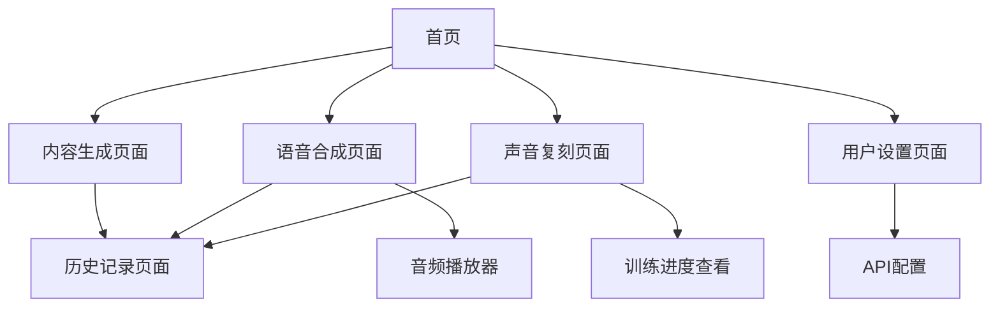

# AI胎教内容生成平台 - 产品需求文档

## 1. 产品概述

AI胎教内容生成平台是一个基于火山引擎AI服务的智能胎教解决方案，为准父母提供个性化的胎教内容生成、多音色语音合成和声音复刻服务。平台通过集成Ark文本生成API、TTS语音合成API和声音复刻API，帮助用户创建高质量的胎教体验。

**核心产品价值：**

* **提升胎教陪伴体验**：通过AI生成个性化内容，让准父母能够为胎儿提供更丰富、更有趣的胎教内容

* **减少家长挑选胎教内容的时间成本**：自动化内容生成，解决准父母不知道讲什么、唱什么的困扰

* **提供个性化、科学化的胎教方式**：基于胎儿发育阶段和家庭偏好，提供定制化的胎教解决方案

* **个性化声音定制**：通过声音复刻技术，让家人的声音陪伴胎儿成长

目标市场价值：满足现代准父母对科学胎教的需求，提供便捷、个性化的AI驱动胎教服务，预计服务10万+准父母家庭。

## 2. 核心功能

### 2.1 用户角色

| 角色   | 注册方式 | 核心权限                 |
| ---- | ---- | -------------------- |
| 普通用户 | 邮箱注册 | 可使用基础内容生成、标准语音合成功能   |
| 高级用户 | 付费升级 | 可使用声音复刻、高级音色、无限制内容生成 |

### 2.2 功能模块

我们的AI胎教平台包含以下主要页面：

1. **首页** 【P0】：产品介绍、功能导航、快速开始按钮
2. **内容生成页面** 【P0】：故事生成、科普内容生成
3. **语音合成页面** 【P0】：文本输入、音色选择、情感控制、音频生成
4. **历史记录页面** 【P0】：内容历史、音频文件管理、导出功能
5. **声音复刻页面** 【P1】：音频上传、训练管理、复刻音色管理
6. **音乐推荐页面** 【P2】：个性化音乐推荐、胎教音乐库
7. **用户设置页面** 【P2】：API配置、偏好设置、账户管理
8. **功能开关管理页面** 【P0】：可视化控制各功能模块的启用状态
9. **API调试面板页面** 【P0】：可视化调试Ark和TTS接口，参数对照展示
10. **日志展示页面** 【P0】：API调用记录监控，错误分析和性能统计
11. **数据仪表盘页面** 【P0】：统计数据可视化，使用趋势和性能指标展示

### 2.3 页面详情

| 页面名称      | 模块名称       | 优先级 | 功能描述                                                                                                           |
| --------- | ---------- | --- | -------------------------------------------------------------------------------------------------------------- |
| 首页        | 产品介绍区      | P0  | 展示平台核心功能和优势，引导用户快速上手                                                                                           |
| 首页        | 功能导航区      | P0  | 提供各功能模块的快速入口和使用指南                                                                                              |
| 内容生成页面    | 故事生成器      | P0  | 基于用户输入生成个性化胎教故事，支持主题和风格选择。输入参数为Ark API的messages数组，每条消息包含role（system/user/assistant）和content（文本内容）              |
| 内容生成页面    | 科普内容生成器    | P0  | 生成胎儿发育相关的科普知识内容。输入参数为Ark API的messages数组，每条消息包含role（system/user/assistant）和content（文本内容）                        |
| 音乐推荐页面    | 音乐推荐引擎     | P2  | 根据胎儿发育阶段推荐适合的胎教音乐                                                                                              |
| 音乐推荐页面    | 个性化推荐      | P2  | 基于用户偏好和使用历史的智能推荐                                                                                               |
| 音乐推荐页面    | 互动小游戏      | P2  | 简单的胎教互动游戏和音乐律动                                                                                                 |
| 语音合成页面    | 文本编辑器      | P0  | 支持富文本编辑，实时字数统计和预览                                                                                              |
| 语音合成页面    | 音色控制面板     | P0  | 选择voiceType、调节speed、音调和emotion参数（前端使用camelCase格式：voiceType, speed, emotion）                                    |
| 语音合成页面    | 音频播放器      | P0  | 实时播放生成的音频，支持下载和分享                                                                                              |
| 声音复刻页面    | 音频上传模块     | P1  | 支持WAV/MP3/OGG/M4A/AAC/PCM格式上传，上传的音频文件会转为Base64（audio\_bytes），必须指定音频格式（audio\_format），单段音频≤30秒，总时长≥1分钟，自动检测音频质量 |
| 声音复刻页面    | 训练进度管理     | P1  | 显示训练状态、进度条和预计完成时间                                                                                              |
| 声音复刻页面    | 复刻音色库      | P1  | 管理已训练的音色，支持试听和删除                                                                                               |
| 历史记录页面    | 内容历史列表     | P0  | 按时间和类型展示历史生成内容，支持搜索和筛选                                                                                         |
| 历史记录页面    | 音频文件管理     | P0  | 批量管理音频文件，支持重命名、删除和导出                                                                                           |
| 用户设置页面    | API配置管理    | P2  | 安全配置火山引擎API密钥和应用ID                                                                                             |
| 用户设置页面    | 偏好设置       | P2  | 自定义默认音色、语速等个人偏好                                                                                                |
| 功能开关管理页面  | 开关控制面板     | P0  | 可视化Toggle组件控制ENABLE\_AUTH、ENABLE\_PAYMENTS、ENABLE\_VOICE\_CLONE、ENABLE\_ANALYTICS四个功能开关                        |
| 功能开关管理页面  | 模式切换       | P0  | 支持MVP模式、沙箱模式、生产模式三种开发模式切换                                                                                      |
| API调试面板页面 | Ark文本生成调试区 | P0  | 输入文本，显示前端参数(camelCase)、后端映射参数(snake\_case)、火山引擎最终调用参数的三栏对照，展示生成结果                                              |
| API调试面板页面 | TTS语音合成调试区 | P0  | 输入文本+选择voiceType/emotion/speed，展示参数对照，播放音频，显示请求JSON与响应结果                                                       |
| 日志展示页面    | 日志记录列表     | P0  | 记录每次API调用的时间戳、接口名、参数摘要、状态码、耗时，支持搜索和过滤                                                                          |
| 日志展示页面    | 错误高亮显示     | P0  | 错误日志高亮显示，提供用户友好提示：401→"未授权，请检查API Key"，429→"请求过多，请稍后再试"，5xx→"服务异常，请稍后重试"                                       |
| 日志展示页面    | 日志导出功能     | P0  | 支持JSON和CSV格式导出日志数据，便于分析和备份                                                                                     |
| 数据仪表盘页面   | 统计概览卡片     | P0  | 展示已生成故事次数、已合成音频次数、平均响应时长、活跃用户数等关键指标                                                                            |
| 数据仪表盘页面   | 使用趋势图表     | P0  | 使用折线图展示7天内的故事生成和音频合成趋势变化                                                                                       |
| 数据仪表盘页面   | API使用分布    | P0  | 使用饼图展示Ark文本生成、TTS语音合成、声音复刻三类API的使用占比                                                                           |
| 数据仪表盘页面   | 响应时间分析     | P0  | 使用柱状图展示各API的响应时间分布和性能变化趋势                                                                                      |
| 数据仪表盘页面   | 实时状态监控     | P0  | 显示各API服务的实时状态（正常/异常/维护中），今日使用情况和成功率                                                                            |

## 3. 核心流程

**普通用户流程：**
用户注册登录 → 配置API密钥 → 选择功能模块（内容生成/语音合成） → 输入需求参数 → 生成内容/音频 → 播放试听 → 保存到历史记录

**高级用户流程：**
用户升级账户 → 上传训练音频 → 创建声音复刻任务 → 监控训练进度 → 使用复刻音色进行语音合成 → 管理个人音色库

## 4. 用户界面设计

### 4.1 设计风格

* **主色调**：温暖的粉色系 (#FFB6C1) 和柔和的蓝色 (#87CEEB)

* **辅助色**：白色 (#FFFFFF) 和浅灰色 (#F5F5F5)

* **按钮样式**：圆角设计，渐变背景，悬停效果

* **字体**：优先使用苹方、微软雅黑等无衬线字体，主标题18px，正文14px

* **布局风格**：卡片式布局，顶部导航栏，响应式设计

* **图标风格**：使用温馨的母婴主题图标，支持SVG格式

* **技术实现**：基于React + TypeScript + Tailwind CSS构建现代化用户界面

### 4.2 页面设计概览

| 页面名称   | 模块名称   | UI元素                       |
| ------ | ------ | -------------------------- |
| 首页     | 产品介绍区  | 大背景图片，渐变遮罩，居中标题和描述文字，CTA按钮 |
| 首页     | 功能导航区  | 3x2网格布局，每个功能卡片包含图标、标题和简介   |
| 内容生成页面 | 故事生成器  | 左侧参数面板，右侧内容预览区，底部生成按钮      |
| 语音合成页面 | 文本编辑器  | 全屏文本框，工具栏，字数统计器            |
| 语音合成页面 | 音色控制面板 | 滑块控件，下拉选择器，实时参数显示          |
| 声音复刻页面 | 音频上传模块 | 拖拽上传区域，进度条，文件列表            |
| 历史记录页面 | 内容历史列表 | 时间轴布局，卡片式内容展示，筛选器          |

### 4.3 响应式设计

平台采用移动优先的响应式设计，支持桌面端、平板和手机端访问。在移动端优化触摸交互，增大按钮尺寸，简化导航结构。

## 5. 运营指标 (KPI)

### 5.1 用户增长指标

* **日活跃用户数 (DAU)**：目标 1,000+ 用户/日

* **月活跃用户数 (MAU)**：目标 10,000+ 用户/月

* **用户留存率**：次日留存率 ≥ 40%，7日留存率 ≥ 25%

### 5.2 业务转化指标

* **用户转化率**：免费用户转付费用户率 ≥ 8%

* **付费用户ARPU**：平均每付费用户收入 ≥ 50元/月

* **用户生命周期价值 (LTV)**：≥ 300元

### 5.3 产品使用指标

* **平均每日音频生成次数**：≥ 5,000次/日

* **平均单用户日使用时长**：≥ 15分钟

* **内容生成成功率**：≥ 95%

* **语音合成成功率**：≥ 98%

* **声音复刻训练成功率**：≥ 90%

### 5.4 用户满意度指标

* **用户满意度评分**：≥ 4.5/5.0

* **NPS净推荐值**：≥ 50

* **客服响应时间**：≤ 2小时

* **Bug反馈处理时间**：≤ 24小时

