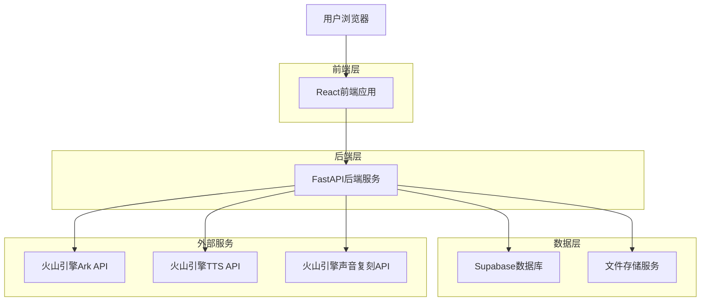
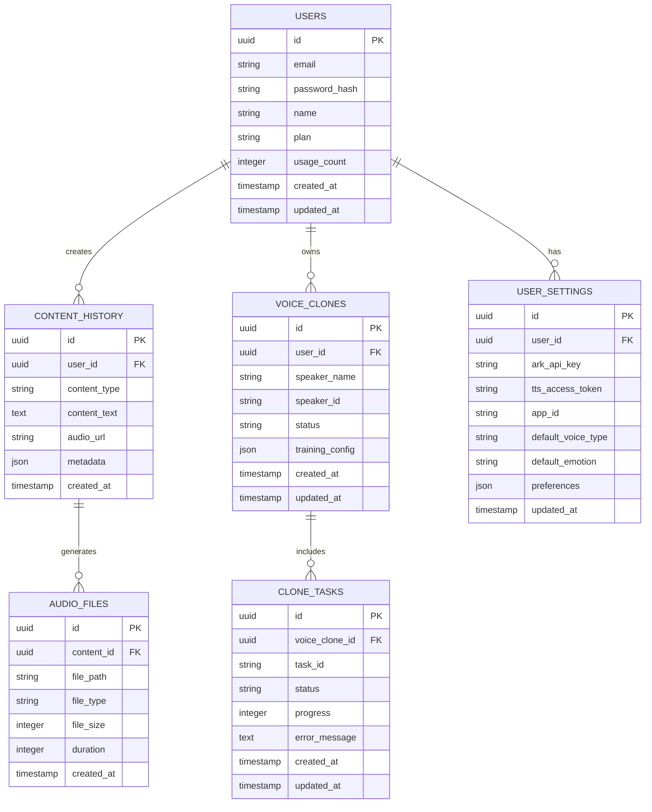

# AI胎教内容生成平台 - 技术架构文档

## 1. 架构设计



## 2. 技术描述

- 前端：React@18 + TypeScript + Tailwind CSS + Vite
- 后端：FastAPI@0.95+ + Python@3.9+ + uvicorn
- 数据库：Supabase (PostgreSQL)
- 文件存储：Supabase Storage
- 外部API：火山引擎 Ark、TTS、声音复刻服务

## 3. 路由定义

| 路由 | 用途 |
|------|------|
| / | 首页，展示产品介绍和功能导航 |
| /generate | 内容生成页面，提供故事和科普内容生成功能 |
| /tts | 语音合成页面，文本转语音功能 |
| /voice-clone | 声音复刻页面，音频上传和训练管理 |
| /history | 历史记录页面，查看和管理生成的内容 |
| /settings | 用户设置页面，API配置和偏好设置 |
| /login | 登录页面，用户身份验证 |
| /register | 注册页面，新用户注册 |

## 4. API定义

### 4.1 核心API

**内容生成相关（基于火山方舟API）**
```
POST /api/generate/story
```

请求参数：
| 参数名称 | 参数类型 | 是否必需 | 描述 |
|----------|----------|----------|------|
| model | string | true | 模型ID，如doubao-seed-1-6-250615 |
| messages | array | true | 对话消息数组 |
| messages[].role | string | true | 角色：system/user/assistant |
| messages[].content | string | true | 消息内容 |
| temperature | number | false | 随机性控制：0.0-1.0，默认0.7 |
| max_tokens | number | false | 最大生成token数，默认2048 |
| top_p | number | false | 核采样参数：0.0-1.0，默认0.9 |
| stream | boolean | false | 是否流式返回，默认false |

响应参数：
| 参数名称 | 参数类型 | 描述 |
|----------|----------|------|
| id | string | 请求唯一标识 |
| object | string | 对象类型：chat.completion |
| created | number | 创建时间戳 |
| model | string | 使用的模型ID |
| choices | array | 生成结果数组 |
| choices[].index | number | 选择索引 |
| choices[].message.role | string | 角色：assistant |
| choices[].message.content | string | 生成的内容 |
| choices[].finish_reason | string | 结束原因：stop/length/content_filter |
| usage.prompt_tokens | number | 输入token数 |
| usage.completion_tokens | number | 输出token数 |
| usage.total_tokens | number | 总token数 |

**语音合成相关**
```
POST /api/tts/synthesize
```

**参数映射说明：**
后端提供参数映射层，前端提交camelCase参数（voiceType, speed, emotion），后端自动转换为snake_case格式调用火山引擎API。

请求参数：
| 参数名称 | 参数类型 | 是否必需 | 描述 |
|----------|----------|----------|------|
| app.appid | string | true | 火山引擎应用ID |
| user.uid | string | true | 用户唯一标识 |
| request.reqid | string | true | 请求唯一ID，建议使用UUID |
| request.text | string | true | 待合成的文本内容 |
| request.voice_type | string | true | 音色类型，如zh_female_tianmeixiaomei_emo_v2_mars_bigtts |
| request.emotion | string | false | 情感参数：happy/sad/angry/neutral等 |
| audio.encoding | string | true | 音频编码格式：mp3/wav/pcm |
| audio.sample_rate | number | true | 音频采样率：8000/16000/22050/24000/32000/44100/48000 |
| audio.speech_rate | number | false | 语速：-50 ~ 100，0为正常语速 |
| audio.loudness_rate | number | false | 音量：-50 ~ 100，0为正常音量 |

响应参数：
| 参数名称 | 参数类型 | 描述 |
|----------|----------|------|
| success | boolean | 合成是否成功 |
| data | string | Base64编码的音频数据 |
| audio_url | string | 音频文件URL |
| duration | number | 音频时长（秒） |

**声音复刻相关**
```
POST /api/voice-clone/train
```

请求参数：
| 参数名称 | 参数类型 | 是否必需 | 描述 |
|----------|----------|----------|------|
| appid | string | true | 火山引擎应用ID |
| speaker_id | string | true | 唯一音色代号 |
| audios | array | true | 训练音频文件列表 |
| audios[].audio_bytes | string | true | Base64编码的音频数据 |
| audios[].audio_format | string | true | 音频格式：wav/mp3/ogg/m4a/aac/pcm（单段音频≤30秒，总时长≥1分钟） |
| audios[].text | string | false | 音频对应的文本内容 |
| source | number | true | 固定值：2 |
| language | number | true | 语种：0=中文，1=英文，2=日语等 |
| model_type | number | true | 训练模式：1=ICL效果，2=DiT标准版，3=DiT还原版 |
| extra_params | string | false | 额外参数JSON字符串 |

响应参数：
| 参数名称 | 参数类型 | 描述 |
|----------|----------|------|
| BaseResp.StatusCode | number | 状态码：0=成功 |
| BaseResp.StatusMessage | string | 状态信息 |
| speaker_id | string | 音色唯一标识 |

示例请求：
```json
{
  "app": {
    "appid": "your_app_id"
  },
  "user": {
    "uid": "user_12345"
  },
  "request": {
    "reqid": "67ee89ba-7050-4c04-a3d7-ac61a63499b3",
    "text": "亲爱的宝贝，祝你做个好梦",
    "voice_type": "zh_female_tianmeixiaomei_emo_v2_mars_bigtts"
  },
  "audio": {
    "encoding": "mp3",
    "sample_rate": 24000,
    "emotion": "happy",
    "speech_rate": 0
  }
}
```

## 5. 服务器架构图

```mermaid
graph TD
    A[客户端/前端] --> B[控制器层]
    B --> C[服务层]
    C --> D[数据访问层]
    D --> E[(Supabase数据库)]
    C --> F[外部API服务]
    
    subgraph 服务器
        B
        C
        D
    end
    
    subgraph 外部服务
        F
    end

## 6. 非功能性需求

### 6.1 性能要求
- **并发用户数**：支持 ≥ 50 并发用户同时使用
- **响应时间**：
  - Ark文本生成延迟 ≤ 10秒
  - TTS语音合成延迟 ≤ 30秒
  - 声音复刻ICL模式 ≤ 5分钟
  - 页面加载时间 ≤ 3秒
  - API响应时间 ≤ 2秒
- **可用性**：系统可用性 ≥ 99.5%
- **吞吐量**：支持每秒 ≥ 100 个API请求

### 6.2 安全要求
- **API密钥管理**：所有API Key必须存储在`.env`文件中，严禁在前端代码中暴露
- **数据传输**：所有API调用必须使用HTTPS加密传输
- **用户认证**：采用Supabase Auth进行用户身份验证和授权
- **数据隐私**：用户上传的音频文件和生成内容需要加密存储
- **访问控制**：实施基于角色的访问控制(RBAC)

### 6.3 监控与日志
- **请求日志**：记录所有API请求的时间戳、用户ID、请求参数和响应状态
- **错误日志**：详细记录系统错误、API调用失败和异常情况
- **性能监控**：监控API响应时间、系统资源使用率和数据库性能
- **报警机制**：
  - API错误率 > 5% 时触发报警
  - 响应时间 > 阈值时触发报警
  - 系统资源使用率 > 80% 时触发报警

### 6.4 扩展性要求
- **水平扩展**：支持通过增加服务器实例来扩展处理能力
- **数据库扩展**：支持读写分离和数据库集群
- **CDN支持**：音频文件通过CDN分发以提高访问速度
- **缓存策略**：实施多级缓存提高系统性能

## 7. CI/CD流程

### 7.1 GitHub Actions工作流

```yaml
name: CI/CD Pipeline

on:
  push:
    branches: [ main, develop ]
  pull_request:
    branches: [ main ]

jobs:
  test:
    runs-on: ubuntu-latest
    steps:
    - uses: actions/checkout@v4
    - name: Setup Node.js
      uses: actions/setup-node@v4
      with:
        node-version: '18'
        cache: 'npm'
    - name: Install dependencies
      run: npm ci
    - name: Run ESLint
      run: npm run lint
    - name: Run TypeScript check
      run: npm run type-check
    - name: Run unit tests
      run: npm run test
    - name: Run E2E tests
      run: npm run test:e2e

  deploy:
    needs: test
    runs-on: ubuntu-latest
    if: github.ref == 'refs/heads/main'
    steps:
    - uses: actions/checkout@v4
    - name: Deploy to Vercel
      uses: amondnet/vercel-action@v25
      with:
        vercel-token: ${{ secrets.VERCEL_TOKEN }}
        vercel-org-id: ${{ secrets.ORG_ID }}
        vercel-project-id: ${{ secrets.PROJECT_ID }}
        vercel-args: '--prod'
```

### 7.2 自动化测试要求
- **单元测试**：覆盖率 ≥ 80%，测试所有核心业务逻辑
- **集成测试**：测试Ark/TTS/声音复刻接口调用链路
- **E2E测试**：测试关键用户流程（注册、登录、内容生成、语音合成）
- **性能测试**：定期进行负载测试和压力测试
- **安全测试**：定期进行安全漏洞扫描

### 7.3 部署策略
- **环境管理**：维护开发、测试、生产三套环境
- **蓝绿部署**：生产环境采用蓝绿部署策略，确保零停机更新
- **回滚机制**：支持快速回滚到上一个稳定版本
- **密钥管理**：部署密钥通过环境变量注入，确保安全性
- **数据库迁移**：使用Supabase迁移脚本管理数据库结构变更
```

## 9. 数据库迁移脚本说明

### 9.1 初始化脚本

创建 `supabase/migrations/001_initial_schema.sql`：

```sql
-- 初始化用户表和相关数据
-- 此脚本应在项目初始化时运行

-- 插入默认用户设置
INSERT INTO user_settings (user_id, default_voice_type, default_emotion, preferences)
SELECT id, 'zh_female_tianmeixiaomei_emo_v2_mars_bigtts', 'neutral', '{"language": "zh-CN", "auto_save": true}'
FROM auth.users 
WHERE id NOT IN (SELECT user_id FROM user_settings WHERE user_id IS NOT NULL);

-- 创建触发器：新用户注册时自动创建设置
CREATE OR REPLACE FUNCTION create_user_settings()
RETURNS TRIGGER AS $$
BEGIN
  INSERT INTO user_settings (user_id, default_voice_type, default_emotion, preferences)
  VALUES (NEW.id, 'zh_female_tianmeixiaomei_emo_v2_mars_bigtts', 'neutral', '{"language": "zh-CN", "auto_save": true}');
  RETURN NEW;
END;
$$ LANGUAGE plpgsql;

CREATE TRIGGER on_auth_user_created
  AFTER INSERT ON auth.users
  FOR EACH ROW EXECUTE FUNCTION create_user_settings();
```

### 9.2 权限设置脚本

创建 `supabase/migrations/002_permissions.sql`：

```sql
-- 设置表权限
-- 用户表权限
GRANT SELECT ON users TO anon;
GRANT ALL PRIVILEGES ON users TO authenticated;

-- 内容历史表权限
GRANT SELECT ON content_history TO anon;
GRANT ALL PRIVILEGES ON content_history TO authenticated;

-- 声音复刻表权限
GRANT SELECT ON voice_clones TO anon;
GRANT ALL PRIVILEGES ON voice_clones TO authenticated;

-- 用户设置表权限
GRANT SELECT ON user_settings TO anon;
GRANT ALL PRIVILEGES ON user_settings TO authenticated;
```

## 8. 数据模型

### 8.1 数据模型定义



### 8.2 数据定义语言

**用户表 (users)**
```sql
-- 创建用户表
CREATE TABLE users (
    id UUID PRIMARY KEY DEFAULT gen_random_uuid(),
    email VARCHAR(255) UNIQUE NOT NULL,
    password_hash VARCHAR(255) NOT NULL,
    name VARCHAR(100) NOT NULL,
    plan VARCHAR(20) DEFAULT 'free' CHECK (plan IN ('free', 'premium')),
    usage_count INTEGER DEFAULT 0,
    created_at TIMESTAMP WITH TIME ZONE DEFAULT NOW(),
    updated_at TIMESTAMP WITH TIME ZONE DEFAULT NOW()
);

-- 创建索引
CREATE INDEX idx_users_email ON users(email);
CREATE INDEX idx_users_plan ON users(plan);
```

**内容历史表 (content_history)**
```sql
-- 创建内容历史表
CREATE TABLE content_history (
    id UUID PRIMARY KEY DEFAULT gen_random_uuid(),
    user_id UUID REFERENCES users(id) ON DELETE CASCADE,
    content_type VARCHAR(50) NOT NULL CHECK (content_type IN ('story', 'knowledge', 'music')),
    content_text TEXT NOT NULL,
    audio_url VARCHAR(500),
    metadata JSONB DEFAULT '{}',
    created_at TIMESTAMP WITH TIME ZONE DEFAULT NOW()
);

-- 创建索引
CREATE INDEX idx_content_history_user_id ON content_history(user_id);
CREATE INDEX idx_content_history_created_at ON content_history(created_at DESC);
CREATE INDEX idx_content_history_type ON content_history(content_type);
```

**声音复刻表 (voice_clones)**
```sql
-- 创建声音复刻表
CREATE TABLE voice_clones (
    id UUID PRIMARY KEY DEFAULT gen_random_uuid(),
    user_id UUID REFERENCES users(id) ON DELETE CASCADE,
    speaker_name VARCHAR(100) NOT NULL,
    speaker_id VARCHAR(100) UNIQUE,
    status VARCHAR(20) DEFAULT 'pending' CHECK (status IN ('pending', 'training', 'completed', 'failed')),
    training_config JSONB DEFAULT '{}',
    created_at TIMESTAMP WITH TIME ZONE DEFAULT NOW(),
    updated_at TIMESTAMP WITH TIME ZONE DEFAULT NOW()
);

-- 创建索引
CREATE INDEX idx_voice_clones_user_id ON voice_clones(user_id);
CREATE INDEX idx_voice_clones_status ON voice_clones(status);
CREATE INDEX idx_voice_clones_speaker_id ON voice_clones(speaker_id);
```

**用户设置表 (user_settings)**
```sql
-- 创建用户设置表
CREATE TABLE user_settings (
    id UUID PRIMARY KEY DEFAULT gen_random_uuid(),
    user_id UUID REFERENCES users(id) ON DELETE CASCADE UNIQUE,
    ark_api_key VARCHAR(500),
    tts_access_token VARCHAR(500),
    app_id VARCHAR(100),
    default_voice_type VARCHAR(50) DEFAULT 'BV001_streaming',
    default_emotion VARCHAR(20) DEFAULT 'neutral',
    preferences JSONB DEFAULT '{}',
    updated_at TIMESTAMP WITH TIME ZONE DEFAULT NOW()
);

-- 创建索引
CREATE INDEX idx_user_settings_user_id ON user_settings(user_id);
```

## 10. 学习友好系统架构

### 10.1 系统概述

学习友好系统是为了帮助新手开发者理解项目运行逻辑而设计的可视化调试和监控系统。该系统包含四个核心模块：

1. **功能开关管理** - 控制各功能模块的启用状态
2. **API调试面板** - 可视化调试和参数对照
3. **日志监控系统** - 实时记录和分析API调用
4. **数据统计仪表盘** - 可视化展示使用统计和性能指标

### 10.2 功能开关API

**GET /api/settings/feature-flags**

获取当前功能开关配置

响应参数：
| 参数名称 | 参数类型 | 描述 |
|----------|----------|------|
| ENABLE_AUTH | boolean | 是否启用注册/登录功能 |
| ENABLE_PAYMENTS | boolean | 是否启用支付与会员升级功能 |
| ENABLE_VOICE_CLONE | boolean | 是否启用声音复刻功能 |
| ENABLE_ANALYTICS | boolean | 是否启用埋点与日志上报功能 |

**POST /api/settings/feature-flags**

更新功能开关配置

请求参数：
| 参数名称 | 参数类型 | 是否必需 | 描述 |
|----------|----------|----------|------|
| ENABLE_AUTH | boolean | false | 注册/登录功能开关 |
| ENABLE_PAYMENTS | boolean | false | 支付功能开关 |
| ENABLE_VOICE_CLONE | boolean | false | 声音复刻功能开关 |
| ENABLE_ANALYTICS | boolean | false | 分析功能开关 |

### 10.3 日志记录API

**GET /api/logs**

获取API调用日志列表

请求参数：
| 参数名称 | 参数类型 | 是否必需 | 描述 |
|----------|----------|----------|------|
| limit | number | false | 返回记录数量，默认100 |
| offset | number | false | 偏移量，默认0 |
| status | string | false | 状态过滤：success/error |
| api | string | false | API类型过滤：ark/tts/voice-clone |

响应参数：
| 参数名称 | 参数类型 | 描述 |
|----------|----------|------|
| success | boolean | 请求是否成功 |
| data | array | 日志记录数组 |
| total | number | 总记录数 |
| limit | number | 当前页大小 |
| offset | number | 当前偏移量 |

日志记录结构：
| 字段名称 | 字段类型 | 描述 |
|----------|----------|------|
| id | string | 日志唯一标识 |
| timestamp | string | 时间戳 |
| apiName | string | API名称 |
| method | string | HTTP方法 |
| url | string | 请求URL |
| statusCode | number | 响应状态码 |
| duration | number | 响应耗时(ms) |
| requestSummary | string | 请求摘要 |
| responseSummary | string | 响应摘要 |
| errorMessage | string | 错误信息(可选) |
| success | boolean | 是否成功 |

**POST /api/logs**

记录API调用日志

请求参数：
| 参数名称 | 参数类型 | 是否必需 | 描述 |
|----------|----------|----------|------|
| apiName | string | true | API名称 |
| method | string | true | HTTP方法 |
| url | string | true | 请求URL |
| statusCode | number | true | 响应状态码 |
| duration | number | true | 响应耗时 |
| requestSummary | string | true | 请求摘要 |
| responseSummary | string | true | 响应摘要 |
| errorMessage | string | false | 错误信息 |
| userId | string | false | 用户ID |
| requestParams | object | false | 请求参数 |
| responseData | object | false | 响应数据 |

**DELETE /api/logs**

清空所有日志记录

**GET /api/logs/stats**

获取统计数据

响应参数：
| 参数名称 | 参数类型 | 描述 |
|----------|----------|------|
| totalCalls | number | 总调用次数 |
| successCalls | number | 成功调用次数 |
| errorCalls | number | 错误调用次数 |
| averageResponseTime | number | 平均响应时间(ms) |
| apiStats | object | 各API统计信息 |

**GET /api/logs/export**

导出日志数据为CSV格式

## 11. 安全架构与密钥管理

### 11.1 安全架构概述

本系统采用多层安全防护策略，确保用户数据和API密钥的安全性。安全架构包括：

1. **密钥管理** - 环境变量隔离和加密存储
2. **访问控制** - 基于角色的权限管理
3. **数据传输** - HTTPS加密和API签名验证
4. **输入验证** - 参数校验和SQL注入防护
5. **监控审计** - 安全事件记录和异常检测

### 11.2 密钥管理规范

#### 11.2.1 密钥分类

**一级密钥（高敏感）**
- 火山引擎 API 密钥 (`VOLCENGINE_ARK_API_KEY`)
- 火山引擎 TTS 访问令牌 (`VOLCENGINE_TTS_ACCESS_TOKEN`)
- Supabase 服务角色密钥 (`SUPABASE_SERVICE_ROLE_KEY`)
- JWT 签名密钥 (`JWT_SECRET`)

**二级密钥（中敏感）**
- 火山引擎应用 ID (`VOLCENGINE_APP_ID`)
- Supabase 项目 URL (`SUPABASE_URL`)
- Supabase 匿名密钥 (`SUPABASE_ANON_KEY`)
- 会话密钥 (`SESSION_SECRET`)

**三级密钥（低敏感）**
- 第三方服务配置
- 非关键功能的API密钥

#### 11.2.2 密钥存储规范

**开发环境**
```bash
# 1. 创建 .env 文件（本地开发）
cp .env.example .env

# 2. 填入真实密钥
vim .env

# 3. 确保 .env 文件被 .gitignore 忽略
echo ".env" >> .gitignore
```

**生产环境**
```bash
# 1. 使用环境变量注入（推荐）
export VOLCENGINE_ARK_API_KEY="your_real_api_key"

# 2. 使用容器密钥管理
docker run -e VOLCENGINE_ARK_API_KEY="$API_KEY" your-app

# 3. 使用云服务密钥管理
# AWS Secrets Manager, Azure Key Vault, 阿里云KMS等
```

#### 11.2.3 密钥轮换策略

**轮换频率**
- 一级密钥：每30天轮换一次
- 二级密钥：每90天轮换一次
- 三级密钥：每180天轮换一次

**轮换流程**
1. 生成新密钥
2. 更新环境变量
3. 验证服务正常
4. 撤销旧密钥
5. 记录轮换日志

#### 11.2.4 密钥访问控制

**权限矩阵**
| 角色 | 一级密钥 | 二级密钥 | 三级密钥 |
|------|----------|----------|----------|
| 开发者 | 只读 | 读写 | 读写 |
| 运维人员 | 读写 | 读写 | 读写 |
| 测试人员 | 无权限 | 只读 | 只读 |
| 产品经理 | 无权限 | 无权限 | 只读 |

**访问审计**
```javascript
// 密钥访问日志记录
const auditKeyAccess = (keyName, action, userId) => {
  console.log({
    timestamp: new Date().toISOString(),
    keyName,
    action, // 'read', 'write', 'rotate'
    userId,
    ip: req.ip,
    userAgent: req.get('User-Agent')
  });
};
```

### 11.3 API安全防护

#### 11.3.1 请求验证

**参数校验**
```typescript
// 输入参数验证
const validateTTSParams = (params: any) => {
  const schema = {
    text: { type: 'string', maxLength: 1000, required: true },
    voiceType: { type: 'string', enum: VALID_VOICE_TYPES, required: true },
    speed: { type: 'number', min: -50, max: 100, required: false },
    emotion: { type: 'string', enum: VALID_EMOTIONS, required: false }
  };
  
  return validateSchema(params, schema);
};
```

**SQL注入防护**
```sql
-- 使用参数化查询
SELECT * FROM content_history 
WHERE user_id = $1 AND content_type = $2
LIMIT $3 OFFSET $4;
```

**XSS防护**
```typescript
// 输出转义
const escapeHtml = (text: string) => {
  return text
    .replace(/&/g, '&amp;')
    .replace(/</g, '&lt;')
    .replace(/>/g, '&gt;')
    .replace(/"/g, '&quot;')
    .replace(/'/g, '&#39;');
};
```

#### 11.3.2 访问限流

**API限流配置**
```typescript
const rateLimitConfig = {
  // 全局限流
  global: {
    windowMs: 15 * 60 * 1000, // 15分钟
    max: 1000 // 最大请求数
  },
  
  // API特定限流
  apis: {
    '/api/generate/story': {
      windowMs: 60 * 1000, // 1分钟
      max: 10 // 最大10次
    },
    '/api/tts/synthesize': {
      windowMs: 60 * 1000, // 1分钟
      max: 20 // 最大20次
    },
    '/api/voice-clone/train': {
      windowMs: 60 * 60 * 1000, // 1小时
      max: 5 // 最大5次
    }
  }
};
```

#### 11.3.3 错误处理安全

**安全错误响应**
```typescript
const secureErrorHandler = (error: Error, req: Request, res: Response) => {
  // 记录详细错误（仅服务端）
  logger.error({
    error: error.stack,
    request: {
      method: req.method,
      url: req.url,
      headers: req.headers,
      body: req.body
    },
    timestamp: new Date().toISOString()
  });
  
  // 返回安全的错误信息（客户端）
  const safeErrors = {
    400: '请求参数错误',
    401: '未授权，请检查 API Key',
    403: '访问被拒绝',
    429: '请求过多，请稍后再试',
    500: '服务异常，请稍后重试'
  };
  
  const statusCode = error.statusCode || 500;
  const message = safeErrors[statusCode] || '未知错误';
  
  res.status(statusCode).json({
    success: false,
    error: message,
    code: statusCode,
    timestamp: new Date().toISOString()
  });
};
```

### 11.4 数据安全

#### 11.4.1 数据加密

**传输加密**
- 所有API调用必须使用HTTPS
- TLS 1.2或更高版本
- 强制HSTS头部

**存储加密**
```typescript
// 敏感数据加密存储
const crypto = require('crypto');

const encryptSensitiveData = (data: string, key: string) => {
  const cipher = crypto.createCipher('aes-256-gcm', key);
  let encrypted = cipher.update(data, 'utf8', 'hex');
  encrypted += cipher.final('hex');
  return encrypted;
};

const decryptSensitiveData = (encryptedData: string, key: string) => {
  const decipher = crypto.createDecipher('aes-256-gcm', key);
  let decrypted = decipher.update(encryptedData, 'hex', 'utf8');
  decrypted += decipher.final('utf8');
  return decrypted;
};
```

#### 11.4.2 数据脱敏

**日志脱敏**
```typescript
const maskSensitiveData = (data: any) => {
  const masked = { ...data };
  
  // 脱敏API密钥
  if (masked.apiKey) {
    masked.apiKey = masked.apiKey.substring(0, 8) + '****';
  }
  
  // 脱敏用户信息
  if (masked.email) {
    const [username, domain] = masked.email.split('@');
    masked.email = username.substring(0, 2) + '****@' + domain;
  }
  
  return masked;
};
```

### 11.5 安全监控

#### 11.5.1 安全事件检测

**异常检测规则**
```typescript
const securityRules = {
  // 频繁失败登录
  suspiciousLogin: {
    condition: 'failed_login_count > 5 in 10 minutes',
    action: 'block_ip_temporarily'
  },
  
  // 异常API调用
  abnormalApiUsage: {
    condition: 'api_calls > 1000 in 1 hour',
    action: 'rate_limit_user'
  },
  
  // 敏感操作
  sensitiveOperation: {
    condition: 'voice_clone_requests > 10 in 1 day',
    action: 'require_additional_verification'
  }
};
```

#### 11.5.2 安全审计

**审计日志格式**
```json
{
  "timestamp": "2024-01-15T10:30:00Z",
  "eventType": "API_ACCESS",
  "severity": "INFO",
  "userId": "user_12345",
  "sessionId": "session_67890",
  "ip": "192.168.1.100",
  "userAgent": "Mozilla/5.0...",
  "resource": "/api/tts/synthesize",
  "action": "POST",
  "result": "SUCCESS",
  "responseTime": 1250,
  "requestSize": 1024,
  "responseSize": 2048,
  "metadata": {
    "apiVersion": "v1",
    "featureFlags": ["ENABLE_TTS"]
  }
}
```

### 11.6 安全检查清单

#### 11.6.1 开发阶段
- [ ] 所有敏感信息存储在环境变量中
- [ ] .env文件已添加到.gitignore
- [ ] 代码中无硬编码密钥
- [ ] 输入参数已进行校验
- [ ] SQL查询使用参数化语句
- [ ] 错误信息不泄露敏感数据

#### 11.6.2 测试阶段
- [ ] 安全扫描通过
- [ ] 渗透测试通过
- [ ] API限流测试通过
- [ ] 错误处理测试通过
- [ ] 权限控制测试通过

#### 11.6.3 部署阶段
- [ ] HTTPS证书配置正确
- [ ] 环境变量安全注入
- [ ] 数据库访问权限最小化
- [ ] 监控告警配置完成
- [ ] 备份恢复流程验证

#### 11.6.4 运维阶段
- [ ] 定期密钥轮换
- [ ] 安全日志监控
- [ ] 漏洞扫描和修复
- [ ] 安全培训和意识提升
- [ ] 应急响应预案准备

### 11.7 合规要求

#### 11.7.1 数据保护法规
- **GDPR** - 欧盟通用数据保护条例
- **CCPA** - 加州消费者隐私法案
- **PIPL** - 中华人民共和国个人信息保护法

#### 11.7.2 行业标准
- **ISO 27001** - 信息安全管理体系
- **SOC 2** - 服务组织控制报告
- **PCI DSS** - 支付卡行业数据安全标准（如涉及支付）

#### 11.7.3 安全认证
- 定期进行第三方安全评估
- 获得相关安全认证
- 建立安全事件响应机制
- 制定数据泄露通知流程

**GET /api/logs/stats**

获取统计数据

响应参数：
| 参数名称 | 参数类型 | 描述 |
|----------|----------|------|
| totalStories | number | 总故事生成次数 |
| totalAudios | number | 总音频合成次数 |
| totalVoiceClones | number | 总声音复刻次数 |
| avgResponseTime | number | 平均响应时间 |
| todayUsage | number | 今日使用次数 |
| successRate | number | 成功率百分比 |
| weeklyData | array | 周数据统计 |
| apiDistribution | array | API使用分布 |
| recentLogs | array | 最近日志记录 |

**GET /api/logs/export**

导出日志数据

请求参数：
| 参数名称 | 参数类型 | 是否必需 | 描述 |
|----------|----------|----------|------|
| format | string | false | 导出格式：json/csv，默认json |

### 10.4 参数映射系统

#### 映射规则

系统实现了前后端参数格式的自动映射：

1. **前端 → 后端映射**
   - `voiceType` → `voice_type`
   - `speed` → `speech_rate`
   - `emotion` → `emotion`
   - `maxTokens` → `max_tokens`
   - `topP` → `top_p`

2. **后端 → 火山引擎映射**
   - 后端参数按照火山引擎API规范进行结构化组装
   - TTS参数组装为完整的请求体结构
   - Ark参数组装为messages数组格式

#### 错误处理映射

| 状态码 | 用户友好提示 |
|--------|-------------|
| 400 | 请求参数错误，请检查输入内容 |
| 401 | 未授权，请检查 API Key |
| 403 | 访问被拒绝，请检查权限设置 |
| 404 | 接口不存在，请检查请求路径 |
| 429 | 请求过多，请稍后再试 |
| 500 | 服务器内部错误，请稍后重试 |
| 502 | 网关错误，请稍后重试 |
| 503 | 服务不可用，请稍后重试 |
| 504 | 请求超时，请稍后重试 |

### 10.5 前端页面架构

#### 页面路由定义

| 路由路径 | 页面组件 | 功能描述 |
|----------|----------|----------|
| `/settings/feature-flags` | FeatureFlags | 功能开关管理界面 |
| `/debug/api` | ApiDebug | API调试面板 |
| `/debug/logs` | DebugLogs | 日志展示页面 |
| `/dashboard` | Dashboard | 数据统计仪表盘 |

#### 组件设计原则

1. **模块化设计** - 每个功能独立成组件
2. **响应式布局** - 支持各种屏幕尺寸
3. **实时更新** - 数据变化实时反映到界面
4. **用户友好** - 提供清晰的操作指引和错误提示
5. **可视化优先** - 使用图表和色彩增强理解

#### 状态管理

- 使用React Hooks进行本地状态管理
- API调用状态通过loading/error/success模式管理
- 功能开关状态通过Context或全局状态管理

### 10.6 数据持久化

#### 本地存储

- 功能开关配置存储在本地JSON文件
- API调用日志存储在本地JSON文件
- 支持最多1000条日志记录的循环存储

#### 数据库存储(可选)

当启用Supabase时，可将数据存储到数据库：

```sql
-- API调用日志表
CREATE TABLE api_logs (
    id UUID PRIMARY KEY DEFAULT gen_random_uuid(),
    user_id UUID REFERENCES auth.users(id),
    api_name VARCHAR(100) NOT NULL,
    method VARCHAR(10) NOT NULL,
    url VARCHAR(500) NOT NULL,
    status_code INTEGER NOT NULL,
    duration INTEGER NOT NULL,
    request_summary TEXT,
    response_summary TEXT,
    error_message TEXT,
    success BOOLEAN NOT NULL,
    request_params JSONB,
    response_data JSONB,
    created_at TIMESTAMP WITH TIME ZONE DEFAULT NOW()
);

-- 统计数据表
CREATE TABLE usage_stats (
    id UUID PRIMARY KEY DEFAULT gen_random_uuid(),
    date DATE NOT NULL,
    total_stories INTEGER DEFAULT 0,
    total_audios INTEGER DEFAULT 0,
    total_voice_clones INTEGER DEFAULT 0,
    avg_response_time INTEGER DEFAULT 0,
    success_rate DECIMAL(5,2) DEFAULT 0,
    updated_at TIMESTAMP WITH TIME ZONE DEFAULT NOW()
);
```

### 10.7 性能监控

#### 关键指标

1. **响应时间监控**
   - API调用平均响应时间
   - 95%分位数响应时间
   - 超时请求统计

2. **成功率监控**
   - 整体API成功率
   - 各API类型成功率
   - 错误类型分布

3. **使用量监控**
   - 日/周/月使用量统计
   - 用户活跃度统计
   - 功能使用分布

#### 告警机制

- 成功率低于90%时触发告警
- 平均响应时间超过5秒时触发告警
- 连续错误超过10次时触发告警

### 10.8 安全考虑

1. **API密钥保护** - 敏感信息不在前端暴露
2. **访问控制** - 调试功能仅在开发环境启用
3. **数据脱敏** - 日志中敏感数据进行脱敏处理
4. **权限验证** - 确保只有授权用户可访问调试功能